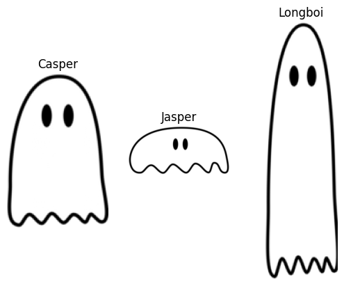
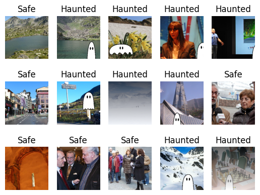

# Haunted attributions

1. A generative dataset based on `Country211` with added ghosts
2. A basic training loop to classify: is it haunted or not?
3. A suite of attribution evaluations

## Installation

Create a conda environment and install packages:
```
conda create -n haunted pytorch torchvision -c pytorch
conda activate haunted
pip install -r requirements.txt
```

And make a directory for the data and models:
```
mkdir data
mkdir models
```

### The data
Three ghosts are sporadically added to the data in order to created haunted images.

Ghost images are courtesy of Stan Kertsjens, subject to [CC-BY](https://creativecommons.org/licenses/by/4.0/legalcode) license.

Additionally we've added fog (in combination with ghosts, or not) in some of the images to make them haunted. The fog is simply a white gradient from bottom to top of the image. Below are some example images.



## Tasks
- [x] Make the dataset
- [x] Write the traing loop
- [ ] Apply and visualize attributions
